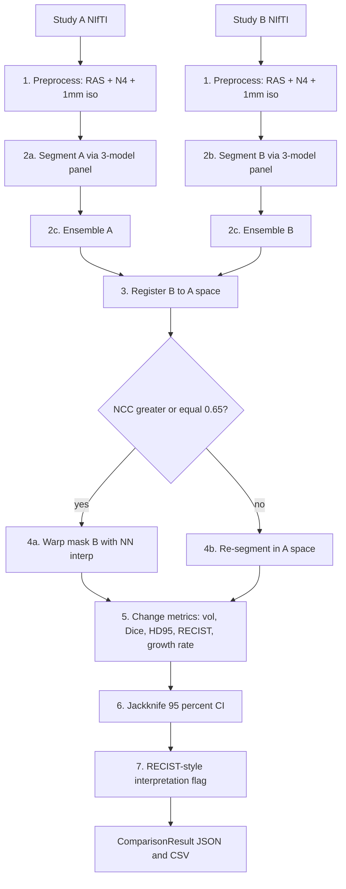
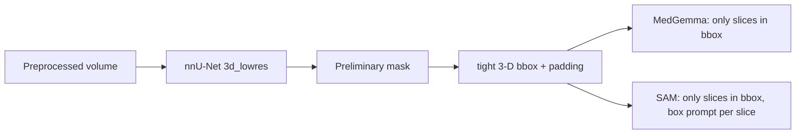

# OncoFlow Inference Algorithm — Technical Notes

> Companion to [IMPLEMENTATION_PLAN.md](../../IMPLEMENTATION_PLAN.md) and
> [inference_algorithm_plan](../../.cursor/plans/) — this document explains
> **what** each stage does, **why** it exists, **how** it works mathematically,
> and **what the tradeoffs are**. Read this before touching the code.

---

## Table of contents

1. [Architecture overview](#1-architecture-overview)
2. [Medical-imaging primer](#2-medical-imaging-primer)
3. [Preprocessing](#3-preprocessing)
4. [The three-model panel](#4-the-three-model-panel)
5. [Adapter pattern & backend selection](#5-adapter-pattern--backend-selection)
6. [Speed strategy](#6-speed-strategy)
7. [Ensemble fusion](#7-ensemble-fusion)
8. [Post-processing](#8-post-processing)
9. [Image registration](#9-image-registration)
10. [Re-segmentation fallback](#10-re-segmentation-fallback)
11. [Longitudinal change metrics](#11-longitudinal-change-metrics)
12. [Uncertainty quantification](#12-uncertainty-quantification)
13. [Interpretation flags (RECIST)](#13-interpretation-flags-recist)
14. [Accuracy strategy & graceful degradation](#14-accuracy-strategy--graceful-degradation)
15. [Configuration system](#15-configuration-system)
16. [Validation on P01](#16-validation-on-p01)
17. [Dependencies — what & why](#17-dependencies--what--why)
18. [Glossary](#18-glossary)

---

## 1. Architecture overview

### 1.1 The clinical problem

A radiation-oncology patient has an MRI at **time A** and another at **time B**
(weeks or months later). The clinician needs to answer:

- Did the tumor grow, shrink, or stay the same?
- By how much (volumetrically, and in terms of longest diameter per RECIST‑1.1)?
- How confident is that answer?

Naive answer: segment both scans, subtract volumes, done. This is **wrong**
because:

- The two scans are acquired on potentially different scanners with different
  voxel sizes, intensity scales, and bias fields.
- The patient's head is in a different position each time (rotation,
  translation, scaling if a different coil was used).
- Segmentation models are noisy: the same anatomy can get different masks from
  different runs.
- Apparent volume change can be dominated by any of the above non-biological
  effects.

### 1.2 The five sequential stages

We implement the **exact 5-stage pipeline** from
[IMPLEMENTATION_PLAN.md Step 4.7](../../IMPLEMENTATION_PLAN.md):



Each stage is a **defensive gate** for a specific failure mode:

| Stage               | Failure mode it prevents                                  |
| ------------------- | --------------------------------------------------------- |
| Preprocess          | Scanner/voxel-size drift biasing downstream metrics       |
| Panel + ensemble    | Single-model blind spots inflating variance               |
| Registration        | Head-position changes being mistaken for tumor change     |
| NCC gate            | Silent registration failure producing invalid comparisons |
| Re-segment fallback | Warping a correct mask into a wrong position              |
| Multi-metric        | Volume change without shape change (or vice versa)        |
| Jackknife CI        | Model disagreement inflating apparent change              |
| Interpretation flag | Clinician misreading a noisy result as real progression   |

---

## 2. Medical-imaging primer

Terms used throughout this doc (see [Glossary](#18-glossary) for full list).

### 2.1 NIfTI & the affine matrix

A NIfTI file is a 3-D volume with a `(4, 4)` **affine matrix** that maps
voxel indices `(i, j, k, 1)` to world coordinates `(x, y, z, 1)` in millimetres:

$$
\begin{bmatrix}
x \\
y \\
z \\
1
\end{bmatrix}
=
A
\begin{bmatrix}
i \\
j \\
k \\
1
\end{bmatrix}
$$

`A` encodes **scale** (voxel size), **rotation/shear** (scanner cosines), and
**translation** (scanner origin). Two scans of the same patient can have the
same patient anatomy but different `A`.

### 2.2 Voxel spacing (zooms)

Extracted from `A` as the column norms of the upper-left 3×3. Example in P01:

```
raw DICOM spacing = (0.449, 0.449, 4.40)   # anisotropic (thick slices)
after 1 mm resample = (1.0, 1.0, 1.0)       # isotropic
```

Isotropic voxels are critical because registration gradient-descent behaves
badly when one dimension is ~10× larger than the others.

### 2.3 Orientations (RAS vs LAS vs LPS)

The three-letter code tells which anatomical direction each axis increases:

- **R**ight, **A**nterior, **S**uperior (RAS) — nibabel canonical
- **L**eft, **A**nterior, **S**uperior (LAS) — flipped X
- **L**eft, **P**osterior, **S**uperior (LPS) — DICOM standard

All our volumes are re-oriented to **RAS+** so left/right is never accidentally
swapped across modalities. This matters most when comparing two scans acquired
on different scanners.

### 2.4 MRI modalities in P01

BraTS format ships 4 modalities per timepoint:

| Code  | Sequence                         | What it highlights                                      |
| ----- | -------------------------------- | ------------------------------------------------------- |
| `t1`  | T1-weighted                      | Gray/white matter contrast; baseline anatomy            |
| `t1c` | T1 with gadolinium contrast      | **Enhancing tumor** (blood-brain-barrier breakdown)     |
| `t2`  | T2-weighted                      | Edema, CSF, non-enhancing tumor                         |
| `fla` | FLAIR (T2 with CSF suppression)  | Edema without CSF signal; most sensitive to lesion mass |

We feed **t1c** as the primary input (matches BraTS convention). Secondary
modalities can be passed to nnU-Net (which accepts multi-channel input).

---

## 3. Preprocessing

Implemented in [`preprocessing.py`](preprocessing.py). Applied **once** per
timepoint; the result is disk-cached content-addressed by input SHA‑256 + the
preprocessing knobs, so re-running comparisons does not repeat this work.

### 3.1 RAS orientation

**What:** Permute/flip axes so the data axes align with (right, anterior, superior).

**Why:** Every downstream consumer — the N4 filter, resampling grid, ANTsPy
registration, slice extraction for MedGemma/SAM — needs a predictable axis
convention. Letting each consumer re-discover the orientation is a bug farm.

**How:**

```python
img = nib.Nifti1Image(vol.data, vol.affine)
ras_img = nib.as_closest_canonical(img)
```

`nib.as_closest_canonical` finds the permutation/flip that brings the affine
closest to diagonal-positive, applies it to both the data and the affine, and
returns a new image. The world coordinates of every voxel are preserved — only
the index labels change.

### 3.2 N4 bias-field correction

**What:** Estimate and divide out a smooth, multiplicative intensity
inhomogeneity field from the image.

**Why:** MRI coil geometry causes a low-frequency intensity bias — the same
tissue can be 20 % brighter near the coil than at the centre of the head.
Three downstream modules break in the presence of bias:

1. **Intensity-based registration** (Mattes MI, Cross-correlation) gets local
   minima from the bias gradient instead of from the real anatomy match.
2. **CNN segmentation** (nnU-Net) was trained on bias-corrected BraTS data; feeding raw
   data shifts the intensity distribution out of training.
3. **Multi-timepoint comparison** — different bias fields between scans can look
   like a lesion that "enhanced".

**How (N4 algorithm, Tustison 2010):**

Assume the observed image \( I \) is the true image \( I^{\text{true}} \)
multiplied by a smooth bias \( B \) plus noise \( N \):

\[
\log I(x) = \log I^{\text{true}}(x) + \log B(x) + \log N(x)
\]

N4 iteratively:

1. **Smooth** the current log-image estimate by convolving with a B-spline
   basis (the bias field \( B \) is assumed to be a smooth B-spline surface).
2. Subtract that estimate from the log-image to sharpen.
3. Repeat at multiple scales (coarse-to-fine pyramid — we use `[50, 40, 30]`
   iterations over 3 levels).

The output is \( \hat I \approx I^{\text{true}} \), and the estimated bias
field can be saved for audit.

**Parameters we use:**

```python
corrector = sitk.N4BiasFieldCorrectionImageFilter()
corrector.SetMaximumNumberOfIterations([50, 50, 50])
```

**Cost:** ~4 s per volume on CPU (measured on P01), runs once, cached.

### 3.3 Isotropic resampling to 1 mm³

**What:** Resample the volume onto a grid with identical spacing in all three
dimensions.

**Why:**

- **Registration:** Affine registration optimises over 12 parameters using
  gradient descent with a spatial smoothness prior. If X and Y are 0.45 mm but
  Z is 4.4 mm, a "1 voxel" step in Z moves ~10× further in the world, breaking
  step-size assumptions.
- **3-D CNNs (nnU-Net):** convolution kernels are expressed in voxels; a
  3×3×3 kernel on anisotropic data means different physical neighbourhoods
  in X vs Z.
- **HD95 and RECIST:** boundary distance metrics only make sense in
  millimetres, which requires a known, uniform physical scale.

**How:**

```python
new_size = [round(sz_i * spacing_i / target_mm) for i in range(3)]
resampler = sitk.ResampleImageFilter()
resampler.SetOutputSpacing((1.0, 1.0, 1.0))
resampler.SetInterpolator(sitk.sitkLinear)   # linear for images
# (nearest-neighbour for masks — see §9.4)
```

**Why linear interpolation for images:** trilinear is smooth, differentiable,
and doesn't introduce values outside the original intensity range the way
cubic B-splines do near edges.

**Why not nearest-neighbour for images:** it aliases — creates a blocky output
that misleads registration.

### 3.4 Skull-stripping (optional)

**What:** Zero out everything outside the brain parenchyma.

**Why:** The skull is a bright feature in T1c that has **no biological
relevance to a tumor metric**. If we don't remove it, rigid/affine registration
can prefer aligning skulls to aligning brains — especially if the patient's
head was tilted differently between scans. Registration will fit the most
salient contrast; the skull is often more salient than the brain boundary.

**Why it's opt-in on macOS:** HD‑BET (the gold-standard skull-strip) requires
CUDA. The CPU fallback (`antspynet.brain_extraction`) is ~60 s and works but
is not always bundled. So we default to OFF locally and let the production
backend enable it once on a GPU node.

**Design note:** If skull-strip is OFF, our Affine registration is still
well-behaved because (a) N4 normalises the skull intensity too, and (b) Mattes
mutual information is robust to bright non-matching features.

### 3.5 Order matters

The chain is:

```
RAS  →  (skull-strip?)  →  N4  →  isotropic resample
```

**Why this order:**

1. **RAS first** — every later step assumes a canonical axis order.
2. **Skull-strip before N4** — N4 estimates the bias over everything inside
   the mask. Including the skull skews the bias estimate, which then over-
   or under-corrects brain tissue.
3. **N4 before resample** — N4 works best at native resolution (it's faster
   and more accurate when the spacing is as collected). Resampling introduces
   smoothing that a subsequent N4 could mistake for bias.

---

## 4. The three-model panel

### 4.1 Why three models, not one?

No single segmentation model dominates on every case. Each has a different
inductive bias, and their error modes are (mostly) uncorrelated:

- **nnU-Net** — pixel-perfect on typical BraTS presentations but struggles on
  out-of-distribution cases (non-enhancing lesions, paediatric patients).
- **MedGemma-1.5** — captures anatomical context via language ("this is the
  cerebellum, tumors there look like X") but is noisy at voxel level and slow.
- **SAM3 / SAM2** — extraordinary generalisation but requires prompting; left
  alone it over-segments.

By running all three and requiring agreement, we:

- **Reduce variance** — classic ensemble gain.
- **Detect uncertainty** — disagreement is a feature, not a bug; it feeds the
  jackknife CI (§12) and triggers the "low agreement" flag (§13).
- **Survive single-model failures** — if HuggingFace is down or a checkpoint
  is corrupt, the pipeline gracefully drops to 2-of-3.

### 4.2 Model 1 — nnU-Net v2

**What it is:** A self-configuring 3-D convolutional network originally from
the DKFZ (Isensee et al., 2021). The "self-configuring" part means given your
dataset it automatically chooses patch size, batch size, normalisation scheme,
augmentation policy, and training schedule based on a dataset "fingerprint"
(median spacing, size, intensity distribution).

**Why it anchors the panel:**

- State-of-the-art on BraTS (brain tumor), KiTS (kidney), LiTS (liver),
  MSD (medical segmentation decathlon) — the standard benchmark hat-trick.
- Produces clean, anatomically-plausible masks (U-Net decoder with skip
  connections preserves boundaries).
- Runs at native voxel grid so volume measurements are exact.

**How it predicts (3D fullres path):**

1. Sliding-window inference: patches of ~(128, 128, 128) with 50 % overlap.
2. Test-time augmentation (TTA): mirror along each axis, average predictions.
   Adds ~8× compute but ~1–3 Dice points; on in `gpu-prod`, off in `local`.
3. Softmax → argmax per voxel → one-hot mask.

**Why we have two backends:**

- `gpu-prod`: official `nnUNetv2_predict` CLI, `3d_fullres` config, TTA on.
  This is the spec from [IMPLEMENTATION_PLAN.md Step 4.2](../../IMPLEMENTATION_PLAN.md).
- `local`: `3d_lowres` config + community BraTS checkpoint, TTA off.
  The `3d_lowres` config is auto-generated by nnU-Net during plan_and_preprocess
  — it's the same architecture at a 2× downsampled resolution, ~4× faster,
  ~1–2 Dice points lower. For the **ROI bootstrap** role (§6) this is plenty.

**Known limitation:** nnU-Net's own team does **not** publish BraTS pretrained
weights (licence reasons). We ship against either a community checkpoint
(e.g., from the BraTS challenge winners' repos) or a MONAI BraTS bundle.
This is explicitly called out in the plan's "Notes & Decisions" section.

### 4.3 Model 2 — MedGemma-1.5

**What it is:** Google's medical-domain multimodal LLM (`google/medgemma-1.5-4b-it`
is the 4 B-parameter instruction-tuned variant). Architecturally it's a
Gemma-3 language model with a vision tower — it accepts images and text in
the same prompt.

**Why it belongs in a segmentation panel:**

- It injects **context**. You can prompt it with the clinical indication
  ("58-yr-old with post-op right-temporal GBM, looking for residual enhancing
  tumor, ignore surgical cavity") and the output adapts.
- It provides a **second opinion** from a different model family —
  transformer-based vision-language instead of CNN.
- For ambiguous cases (small enhancement, post-operative), it may reject
  false positives that a pure CNN would commit.

**How it predicts (slice-wise):**

MedGemma is not natively a 3-D segmentation model. We run it slice-wise:

```python
for z in roi_z_range:       # typically 10-30 slices, not all 150+
    slice_img = volume[:, :, z]
    prompt = "Segment all tumor regions in this brain MRI slice. "
             "Output a binary mask where 1=tumor, 0=background."
    messages = [{"role": "user", "content": [
        {"type": "image"}, {"type": "text", "text": prompt}]}]
    inputs = processor.apply_chat_template(messages, images=[slice_img], ...)
    out = model.generate(**inputs, max_new_tokens=512)
    mask_2d = parse_bounding_boxes(out)  # or semantic mask decoder
mask_3d = np.stack(masks_2d, axis=-1)
```

**Why slice-wise:** (1) the vision tower expects 2-D input; (2) the KV cache
for a full volume would blow memory.

**Output parsing:** MedGemma-1.5 outputs structured JSON with
`box_2d` coordinates normalised to `[0, 1000]`. We convert to a slice-level
mask by filling the boxes; optional upgrade is to prompt for polygon vertices.

**Fallback when `HF_TOKEN` absent:** swap to `microsoft/llava-med-v1.5-mistral-7b`
which has a similar VLM interface but open licence. When even that's missing
the adapter returns `is_available() = False` and the ensemble drops to 2-of-3.

**Why it's slow on Mac:** the processor serialises every slice through the
Gemma attention stack with ~8192-token context (image tokens + prompt +
generation). On MPS in fp16, ~60–80 s/slice for a full 150-slice volume,
which is unacceptable. Our mitigations (see §6):

- ROI gating — only ~20 slices near the tumor.
- `max_new_tokens` small.
- Slice batching in the processor where supported.
- Skip predicted-empty slices early.

### 4.4 Model 3 — SAM3 (with SAM2 fallback)

**What it is:** Meta's Segment Anything Model 3 (released Nov 2025) extends
SAM 2 with native volumetric reasoning and improved promptability. SAM 2
(Aug 2024) added video / temporal consistency to SAM 1's 2-D image
segmentation.

**Why it belongs in the panel:**

- Unparalleled **generalisation** — SAM was trained on 1 B+ masks across
  arbitrary domains. It's the least likely model to silently fail on an
  out-of-distribution presentation.
- **Promptable** — a clinician can click a point on the UI and SAM refines
  the mask in real time. This is the interactive-refinement path
  ([IMPLEMENTATION_PLAN.md Step 4.4](../../IMPLEMENTATION_PLAN.md)).
- Complements CNN + VLM with a foundation-model perspective.

**How we use it in automatic mode:**

```python
# Derive a box prompt from nnU-Net's preliminary mask (ROI bootstrap)
bbox = tight_bbox_per_slice(nnunet_mask)

for z in range(D):
    predictor.set_image(to_rgb(volume[:, :, z]))
    masks, scores, _ = predictor.predict(box=bbox[z], multimask_output=False)
    out_mask[:, :, z] = masks[0]
```

**Why we bootstrap from nnU-Net:** SAM in pure automatic mode produces
everything-masks for every anatomical structure it can find. By seeding a box
prompt we focus it on the tumor region. The nnU-Net mask doesn't need to be
perfect — SAM refines the boundary from the image directly.

**Why two backends:**

- `gpu-prod`: real SAM3 in volumetric mode per the plan.
- `local`: SAM 2 hiera-large with 2-D per-slice prediction (fast on MPS) +
  inter-slice propagation to enforce volumetric consistency.

**Fallback chain:** SAM 3 → SAM 2 → MedSAM (`bowang-lab/MedSAM`, a SAM 1
fine-tune on medical data) → `is_available() = False`.

### 4.5 Summary comparison

| Axis                  | nnU-Net              | MedGemma-1.5              | SAM3 / SAM2                   |
| --------------------- | -------------------- | ------------------------- | ----------------------------- |
| Architecture          | 3-D CNN U-Net        | Transformer VLM           | Vision transformer + mask decoder |
| Input                 | 3-D multi-modal      | 2-D slice + prompt        | 2-D/3-D + point/box prompt    |
| Speed (per volume)    | Fast (seconds on GPU) | Slow (minutes)           | Medium (tens of seconds)      |
| Training data         | BraTS / KiTS / etc.  | Web medical images + text | 1 B+ general masks            |
| Strength              | Accurate volumes     | Context awareness         | Generalisation, prompting     |
| Weakness              | OOD cases            | Slow, slice-only          | Needs prompting               |
| License               | Apache-2.0           | Gated (HF approval)       | Apache-2.0 (Meta)             |

---

## 5. Adapter pattern & backend selection

### 5.1 The contract

Every segmentation model hides behind a single interface:

```python
class SegmentationAdapter(Protocol):
    name: Literal["nnunet", "medgemma", "sam3"]
    def is_available(self) -> bool: ...
    def load(self) -> None: ...
    def predict(self, vol: Volume, *, roi: Bbox | None = None) -> AdapterResult: ...
```

**Why a Protocol and not an ABC:** Python's `Protocol` supports structural
typing — any class with these methods implements the interface, no inheritance
required. This lets us drop in third-party adapters later without forcing them
to import our base class.

**Why `is_available()` returns `False` instead of raising:**

- **Graceful degradation.** The pipeline runs whatever is available and the
  ensemble re-weights over the remaining models.
- **Idempotent health checks.** The CLI can print a "models ready" status
  at startup without a try/except tree.
- **CI compatibility.** Unit tests run the pipeline with zero models loaded
  and verify the skeleton works.

### 5.2 The `backend` switch

```python
NNUNetAdapter(backend="local")      # M1 laptop, community BraTS ckpt, fast config
NNUNetAdapter(backend="gpu-prod")   # A100 node, nnUNetv2_predict CLI, TTA on
```

**Why one flag flips every adapter:** the caller (pipeline or CLI) should not
have per-model knowledge of "fast local mode". A single `cfg.backend="local"`
propagates to every adapter's constructor, and each adapter decides what
"local" means for it.

| Adapter   | `local` means…                                                     | `gpu-prod` means…                                 |
| --------- | ------------------------------------------------------------------ | ------------------------------------------------- |
| nnunet    | 3d_lowres, no TTA, community ckpt, Python API                      | 3d_fullres, TTA on, subprocess CLI                |
| medgemma  | ROI-gated slices, fp16 on MPS, ≤ `medgemma_max_slices` slices      | Full-volume slice-wise, bf16, `device_map="auto"` |
| sam3      | SAM 2 with box prompts from nnU-Net, slice-wise                    | SAM 3 volumetric, automatic mode                  |

### 5.3 Lazy-loading & module-level caching

Each adapter loads weights **the first time `predict()` is called**, not at
construction, and caches the model in a module-level singleton:

```python
_MODEL = None
def _get_model(cfg):
    global _MODEL
    if _MODEL is None:
        _MODEL = load_weights(cfg)
    return _MODEL
```

**Why:** (a) constructing an adapter in a process that never calls it should
cost ~0; (b) a single Python process should not double-load a 4 B-parameter
transformer across calls.

**Why singleton and not instance cache:** we want the cache to survive even if
the caller re-constructs the adapter. Module-level state is process-scoped
which is the right lifetime.

### 5.4 Stubs when weights absent

When `is_available() == False`, `predict()` still returns a valid
`AdapterResult` with `mask = zeros((H, W, D), dtype=uint8)` and
`meta["stub"] = True`. This way:

- The ensemble code handles stubs uniformly (a stub mask contributes nothing
  to majority vote; it doesn't special-case the "fewer than 3 models" path).
- Tests run without any model weights (see `test_p01_smoke.py`).

---

## 6. Speed strategy

Mac-native inference of the full 3-model panel on a 150-slice volume would
take **hours** naïvely. We hit **~minutes** with seven optimisations.

### 6.1 Preprocess once, cache forever

Preprocessing (RAS + N4 + isotropic resample) takes ~5 s on CPU. Running it
per adapter would cost 15 s; per patient-study-comparison, more. Instead:

```
cache_dir / <sha256(input)[:16]>__preproc_iso1.0_n4_ras / preprocessed.nii.gz
```

The cache key incorporates the preprocessing knobs, so changing
`isotropic_spacing_mm` busts the cache automatically.

**Invariant:** the preprocessed volume is the *single* source of truth fed to
registration and all three adapters. Their masks therefore share a coordinate
system by construction.

### 6.2 ROI bootstrap

Observation: on P01, a typical tumor occupies ~20 consecutive axial slices out
of ~150. There is no reason to run MedGemma on slices where the bootstrap says
"no tumor here".



**Padding (`roi_padding_voxels=8`):** guards against the preliminary mask
under-segmenting — we expand the bbox so MedGemma/SAM see a margin around
the tumor and can refine the boundary outward.

**Cost–benefit:** nnU-Net 3d_lowres on CPU/MPS is ~10–30 s. MedGemma savings
are ~10× (30 s → 3 s per slice at a reasonable depth, × 20 slices =
60 s vs 4500 s). Net win: ~50×.

### 6.3 Parallel fan-out

Once the ROI is known, MedGemma and SAM are independent:

```python
with ProcessPoolExecutor(max_workers=2) as ex:
    f_mg = ex.submit(run_medgemma, vol, roi, cfg)
    f_sm = ex.submit(run_sam, vol, roi, cfg)
    medgemma_result = f_mg.result()
    sam_result = f_sm.result()
```

**Why `ProcessPoolExecutor`, not `ThreadPoolExecutor`:** PyTorch with MPS (and
even CUDA with certain operations) is not thread-safe; two tensors being
created on the same device from different threads races on the allocator.
Process isolation avoids this at the cost of model-loading duplication — but
each process only loads the model it needs, so we pay the load cost once per
model regardless.

**Why nnU-Net runs first (not parallel):** its mask is an input to MedGemma
and SAM prompting, so the DAG forces it to be sequential.

### 6.4 Mixed precision

Auto-picked by `config.resolve_device()` / `config.resolve_dtype()`:

| Device | dtype    | Reasoning                                                      |
| ------ | -------- | -------------------------------------------------------------- |
| CUDA   | bfloat16 | Preserves dynamic range; Ampere+ has native bf16 tensor cores  |
| MPS    | float16  | Apple Silicon MPS does not support bf16 (as of torch 2.2)      |
| CPU    | float32  | No meaningful speedup from fp16 on CPU; numerical safety first |

### 6.5 Slice batching

Where the processor supports it:

```python
inputs = processor(images=[slice_0, slice_1, ..., slice_7], text=prompt, ...)
# Generate all 8 slices in one forward pass
outputs = model.generate(**inputs)
```

~2–3× speedup on MedGemma when sequence length is dominated by the prompt.

### 6.6 Disk-cached masks

Per-adapter masks are also cached, keyed by
`(input_sha256, model_id, backend, config_fingerprint)`:

```
cache_dir / <sha16>__nnunet_local_3d_lowres / mask.nii.gz
cache_dir / <sha16>__medgemma_local_t1c     / mask.nii.gz
cache_dir / <sha16>__sam_local_sam2-hiera   / mask.nii.gz
cache_dir / <sha16>__ensemble_majority_vote / mask.nii.gz
```

Re-running `compare_studies(A, B)` on an already-segmented pair is
**~seconds** — only registration + metrics are recomputed.

### 6.7 Benchmarking harness

`benchmark/p01.py` runs the full pipeline on all 5 timepoints and emits:

- `leaderboard.csv` — per-model per-timepoint Dice/IoU/HD95/volume/runtime.
- `wall_clock.csv` — per-stage wall-clock.
- `volume_curve.png` — ensemble volume vs GT volume across timepoints.
- `agreement.png` — per-comparison model-agreement scores.

This is the artefact we use to **iterate on speed**: we run it, inspect, tune,
re-run (cache hit on everything except what changed).

---

## 7. Ensemble fusion

All fusion strategies take `{model_name: mask}` and return a single mask.

### 7.1 Majority vote (default)

```python
stack = np.stack(list(masks.values()), axis=0)   # (N, H, W, D)
ensemble = (stack.sum(axis=0) >= (N + 1) // 2).astype(np.uint8)
```

With `N = 3`, `(3+1)//2 = 2` — a voxel is "tumor" if ≥ 2 models agree.

**Why this is the default:**

- Simple to explain to a radiologist.
- Robust to one model failing entirely (mask of zeros) — the remaining two
  still produce a sensible ensemble.
- No calibration assumption — works even if the models' probability outputs
  are on different scales.
- Natural probabilistic interpretation: a Dice‑0.9 and Dice‑0.6 model voting
  together outperforms either alone in practice.

**Edge case with N = 2:** after one model drops out, "majority" = "both agree".
This is **intersection** in disguise and can under-segment. We mitigate with
the `agreement_review_threshold` flag (§13): if fewer than 3 models were
available, the report is auto-flagged for radiologist review regardless of
agreement score.

### 7.2 Union

```python
ensemble = np.any(stack.astype(bool), axis=0)
```

**When to use:** high-recall screening — never miss a possible tumor voxel.
Dice-wise worse than majority on average, but useful for bootstrapping SAM
prompts (§4.4) where we want a generous ROI.

### 7.3 Intersection

```python
ensemble = np.all(stack.astype(bool), axis=0)
```

**When to use:** high-precision claims — only trust a voxel if all models
agree. Under-segments and should not be used for volume reporting.

### 7.4 STAPLE (Warfield 2004)

Simultaneous Truth and Performance Level Estimation. Models each rater
(segmentation model) as having an unknown **sensitivity** \( p \) and
**specificity** \( q \) per voxel. EM algorithm:

- **E-step:** given current \( (p_i, q_i) \) per model, estimate the
  posterior probability \( P(\text{true tumor} | \text{model outputs}) \).
- **M-step:** given the posterior, re-estimate \( (p_i, q_i) \).
- Iterate to convergence (~10 iterations).

```python
sitk_masks = [sitk.Cast(sitk.GetImageFromArray(m.astype(np.uint8)), sitk.sitkUInt8)
              for m in masks.values()]
staple = sitk.STAPLEImageFilter()
staple.SetForegroundValue(1)
probability_map = staple.Execute(sitk_masks)  # soft
ensemble = sitk.GetArrayFromImage(probability_map) > 0.5
```

**When to use:** when you believe one model is *systematically* worse than
another (different sensitivities) and you want the fusion to weight the
better one higher automatically.

**Tradeoff:** more computationally expensive, sometimes unstable if model
disagreement is extreme. We offer it but do not default to it until we have
labelled Ichilov data to validate on.

### 7.5 Confidence-weighted

If models expose soft probability maps \( p_i(x) \) (nnU-Net: softmax output;
MedGemma/SAM: can expose logits), we can do a per-voxel weighted average:

\[
\hat p(x) = \frac{\sum_i w_i \cdot p_i(x)}{\sum_i w_i}, \quad
\text{ensemble}(x) = \hat p(x) > 0.5
\]

Weights can be uniform, or learned from a validation set (oracle-weighted in
development). This is the theoretical best strategy but requires reliable
probability calibration from every adapter, which MedGemma currently does
not provide.

### 7.6 Agreement score

Independent of the strategy, after the ensemble is formed we compute:

\[
\text{agreement} = \frac{1}{N} \sum_i \text{Dice}(m_i, \text{ensemble})
\]

Bands used in the UI / interpretation flag:

```
agreement ≥ 0.90  High agreement       auto-report
0.75–0.89         Moderate             flag for radiologist review
< 0.75            Low                  require manual segmentation check
```

(Thresholds come from [IMPLEMENTATION_PLAN.md Step 4.5](../../IMPLEMENTATION_PLAN.md).)

---

## 8. Post-processing

Applied to the ensemble mask before it's saved or compared.

### 8.1 Connected-component filtering

```python
from scipy.ndimage import label
labeled, n = label(mask)
sizes = np.bincount(labeled.ravel())
# keep components ≥ min_component_voxels
keep = np.zeros_like(mask)
for i in range(1, n + 1):
    if sizes[i] >= cfg.min_component_voxels:
        keep |= (labeled == i)
```

**Why:** Single-model segmentation often produces "salt" — isolated 1–5 voxel
speckles far from the main lesion. These are almost never real; they inflate
volume estimates and dominate the HD95 metric.

**Default:** `min_component_voxels = 20` ≈ 0.02 cm³ at 1 mm iso. Tumors
under this threshold are below the noise floor of MRI at clinical resolution.

**Optional "largest only":** for single-lesion cases we keep only the largest
component. This is *not* default because multifocal GBM and metastatic disease
are common and clinically important.

### 8.2 Morphological closing (opt-in)

```python
from scipy.ndimage import binary_closing
mask = binary_closing(mask, iterations=radius)
```

**When to use:** when adapter outputs are "peppered" with 1-voxel holes inside
a tumor region. Closing fills them.

**When NOT to use:** defaults to `morph_closing_radius = 0` because overzealous
closing can bridge two separate lesions into one, corrupting lesion counts.

---

## 9. Image registration

### 9.1 Why registration is the critical step

Given mask_A in volume_A space and mask_B in volume_B space, we want to
measure change. But "change" is only meaningful if the two masks are in the
**same coordinate system**. Two voxels at `(i, j, k)` in A and in B refer to
different physical locations if the heads are in different positions.

Registration finds a spatial transformation \( T: \mathbb{R}^3 \to \mathbb{R}^3 \)
that maps world-coordinates in B's frame to A's frame such that \( T(B) \)
looks as much like \( A \) as possible under a chosen similarity metric.

### 9.2 Transformation classes

| Class  | DOF | What it models                                | When to use                                 |
| ------ | --- | --------------------------------------------- | ------------------------------------------- |
| Rigid  | 6   | Rotation + translation                        | Same anatomy, same scanner, minutes apart   |
| Affine | 12  | + Scale + shear                               | Same patient, different session / scanner   |
| SyN    | ∞   | Deformable (dense displacement field)         | Post-surgery, very different timepoints     |

We default to **Affine** (12 DOF). Why:

- **Rigid is too restrictive** — minor scanner-coil differences and patient
  weight changes introduce small apparent scaling that a rigid fit cannot
  absorb.
- **SyN is too flexible on healthy baselines** — the tumor itself has
  *deformed* between scans. If we let the warp deform to match, we'll align
  the tumors and conclude no change occurred. Affine warps preserve
  straight lines, so the tumor cannot be smooshed to match.

**Escape hatch:** the config has `registration_type: "Rigid" | "Affine" | "SyN"`;
clinical users can upgrade to SyN for > 6-month follow-ups or post-surgery
cases, as called out in the plan.

### 9.3 Similarity metrics

ANTsPy offers several; we use **Mattes mutual information** (`aff_metric="mattes"`).

- **Cross-correlation (NCC)** works when both images have the same intensity
  contrast (e.g. T1 vs T1 of the same patient). Fragile across scanners.
- **Mean squared error** assumes identical intensities. Fails for MRI.
- **Mutual information (Mattes 1997):** measures statistical dependence
  between the intensity histograms of the fixed and moving image:

\[
\text{MI}(A, B) = \sum_{a, b} p(a, b) \log \frac{p(a, b)}{p(a) \, p(b)}
\]

  where \( p(a, b) \) is the joint intensity histogram (Parzen-windowed for
  differentiability). MI peaks when the two images are well-aligned even if
  their brightness ranges differ.

**Why MI for registration, NCC for the gate:** we use MI as the **driver**
(what gradient descent optimises) because it's robust. We use NCC as the
**verifier** (what we report as quality score) because it has an intuitive
[0, 1] range and maps naturally to "how similar do the two images look now".

### 9.4 Applying the transform to a mask

**Critical detail from [IMPLEMENTATION_PLAN.md Step 4.7 Stage 2](../../IMPLEMENTATION_PLAN.md):**

```python
warped = ants.apply_transforms(
    fixed=reference_image,
    moving=mask_img,
    transformlist=fwd_transforms,
    interpolator="nearestNeighbor",   # CRITICAL
)
```

**Why nearest-neighbour for masks, linear for images:**

A mask is binary: voxel is either tumor (1) or not (0). If we use linear
interpolation when warping a mask:

- At the boundary, a voxel lying 0.5 world-mm inside the mask gets value
  `0.5 + 0.5 * neighbor = 0.5–1.0`.
- Thresholding at 0.5 again is lossy — information about sub-voxel boundary
  position is destroyed.
- Worse, volume is not preserved: a linear-interpolated-then-thresholded
  mask is almost always **larger** than the original by a voxel layer per
  face. Over a 20 mm tumor, that's a ~10% spurious growth signal between
  timepoints purely from interpolation.

Nearest-neighbour picks the single closest source voxel (0 or 1). Volume is
preserved to within one voxel per component; importantly, **the same mask
warped twice by identity = same mask**.

### 9.5 NCC "before" and "after"

We record both:

- `ncc_before` — similarity at the initial alignment (just header affines).
- `ncc_after` — similarity after the optimiser converged.

**Why both:** `ncc_after` alone tells you the final quality, but comparing
before vs after tells you whether **registration actually helped**. If
`after ≈ before`, the optimiser didn't move — likely the initial alignment
was already correct (good) *or* the optimiser got stuck immediately (bad).
Reviewing both catches this.

### 9.6 Quality gate thresholds

```
NCC_after ≥ 0.85   good — trust the warp
0.65 ≤ NCC_after < 0.85   marginal — warp and compare, flag
NCC_after < 0.65   poor — do NOT warp the mask; re-segment in A's space (§10)
NCC_after < 0.55   fail — do NOT compare at all; raise to radiologist
```

Thresholds come from [IMPLEMENTATION_PLAN.md Step 4.7 Stage 5](../../IMPLEMENTATION_PLAN.md)
and are **calibrated per-dataset**; we expose them in `InferenceConfig` so
Ichilov can re-tune.

---

## 10. Re-segmentation fallback

When `NCC_after < 0.65`, we **do not** warp the mask from B's space into A's
space. Instead:

```python
# Step 1: warp the B *image* (not mask) to A's space.
warped_image_B = ants.apply_transforms(fixed=A, moving=B, transformlist=T,
                                       interpolator="linear")
# Step 2: re-run nnU-Net on the warped image → fresh mask directly in A's space.
fresh_mask = nnunet.predict(warped_image_B)
```

**Why this is safer than warping a possibly-misaligned mask:**

A mask depends on its source image's local intensity pattern. If the warp
misaligned the image, the *image* is now wrong in A's space, but the mask
from B was derived from the *original* image's intensity pattern — it is
"correct but for the wrong image". Running segmentation again on the warped
image produces a mask that at least agrees with the (possibly-flawed) image
it was computed from. The alternative (warping a good mask onto a bad image)
creates an internal inconsistency that downstream metrics can't detect.

**Cost:** one extra nnU-Net inference. Cheap relative to the risk.

**Why nnU-Net specifically for the fallback** (not the full panel): nnU-Net is
the most reliable and cheapest on the panel; we don't need model diversity
here because we just need an up-to-date mask, not an ensemble.

---

## 11. Longitudinal change metrics

All computed in the **registered space** (A's coordinate system).

### 11.1 Volume

\[
V = \text{count}(\text{mask} > 0.5) \times \prod \text{spacing} \, / \, 1000
\]

Output in cm³. At 1 mm isotropic, 1 voxel = 0.001 cm³, so a 1 cm³ tumor = 1000
voxels — comfortably above quantisation noise.

### 11.2 Volume delta & percent change

```
delta_cm3 = V_B - V_A
pct_change = 100 * delta_cm3 / V_A
```

**Pct change is the RECIST-ish metric** used for thresholding the final flag
(§13). Raw delta is reported too because it's more interpretable for small
lesions (e.g., "grew by 0.3 cm³" is easier to grasp than "30 %").

### 11.3 Dice coefficient (registered space)

\[
\text{Dice}(A, B) = \frac{2\, |A \cap B|}{|A| + |B|}
\]

Range [0, 1]. In the longitudinal context, this is **not an accuracy metric**
— it's a **spatial-overlap metric** between the two timepoints.

- Dice = 1 means the two masks occupy the exact same voxels.
- Dice = 0.8 with volumes equal means the mask moved ~1–2 voxels (boundary
  shift).
- Dice = 0.5 with volumes equal means the boundary shifted significantly
  even though the size is unchanged — could be tumor migrating.

This is what lets the algorithm detect "shape change without volume change",
which RECIST alone misses.

### 11.4 Hausdorff distance 95 (HD95)

Let \( S_A \) and \( S_B \) be the surface voxel sets of A and B.

\[
\text{HD}_{95}(A, B) = \text{percentile}_{95} \left( \{ d(p, S_B) : p \in S_A \} \cup \{ d(q, S_A) : q \in S_B \} \right)
\]

In mm (because we registered on a 1 mm iso grid). Captures "how far did the
boundary move?" in physical units, which volume / Dice don't directly
report.

**Why 95th percentile and not max (Hausdorff proper):** max HD is dominated by
outlier voxels (the one stray speckle that didn't get CC-filtered). 95th
percentile is robust — it says "95 % of the boundary moved less than this".

### 11.5 RECIST-1.1 longest diameter

RECIST is the clinical standard for solid-tumor response assessment. The
simplified version we implement:

1. Find the largest connected component.
2. Project onto the axial plane (most clinical reading is done axial).
3. Measure the longest chord through the projected shape.
4. Convert to mm using the in-plane spacing.

```python
labeled, n = label(mask)
largest = np.argmax([np.sum(labeled == i) for i in range(1, n+1)]) + 1
lesion = (labeled == largest)
axial = lesion.any(axis=2)
# longest diameter = max chord through the axial silhouette
```

**Why we implement a simplified version:** true RECIST is measured by a human
radiologist on a single axial slice and requires careful selection of the
"target lesion". We produce a reproducible proxy; clinicians verify via the
UI.

**RECIST ratio:** `recist_B / recist_A` — < 0.7 ≈ partial response;
> 1.2 ≈ progression.

### 11.6 Growth rate

\[
\text{rate} = \frac{V_B - V_A}{\Delta t_{\text{days}}}
\]

In cm³/day. Useful for comparing across patients with different scan
intervals — a 10 % growth over 30 days is very different from a 10 % growth
over 180 days.

---

## 12. Uncertainty quantification

### 12.1 Why we need it

A single ensemble volume is a point estimate. A clinician needs to know:
"is this 20 % growth real, or within my model's noise floor?"

We use a **jackknife** estimator over the three per-model volumes — the same
data the ensemble was made from, but now used to probe sensitivity to
dropping any single model.

### 12.2 Jackknife definition

Given model volumes \( V_1, V_2, V_3 \) at timepoint A and the deltas
\( \delta_i = V_B^{(i)} - V_A^{(i)} \):

1. Compute \( \delta = \bar V_B - \bar V_A \) (ensemble-mean delta).
2. For each \( i \), compute the leave-one-out delta
   \( \delta_{(-i)} = \text{mean}_{j \ne i}(V_B^{(j)}) - \text{mean}_{j \ne i}(V_A^{(j)}) \).
3. Jackknife standard error:
   \[
   \text{SE}_{jk} = \sqrt{\frac{N - 1}{N} \sum_i (\delta_{(-i)} - \bar \delta_{(-\cdot)})^2}
   \]
4. 95 % half-width: \( \text{CI}_{95/2} = 1.96 \cdot \text{SE}_{jk} \).

In code (simplified — see `longitudinal/uncertainty.py`):

```python
vols_a = np.array([V_a_nnunet, V_a_medgemma, V_a_sam])
vols_b = np.array([V_b_nnunet, V_b_medgemma, V_b_sam])
deltas = vols_b - vols_a
jk = [np.delete(deltas, i).mean() for i in range(len(deltas))]
ci_half = 1.96 * np.std(jk) * np.sqrt(len(deltas) - 1)
```

### 12.3 Interpretation

- `ci_half / |delta| ≤ 0.15` — high confidence; all three models agree.
- `ci_half / |delta| > 0.15` — models disagree materially; **flag for review**.

Why 15 %: clinical progression is typically declared at 25 % volume change
(RECIST PD). If our CI is wider than 60 % of that threshold (15 ≈ 0.6 × 25),
we cannot distinguish real progression from model variance.

**Why jackknife specifically** (vs bootstrap, Bayesian, ensemble):

- We only have 3 samples. Bootstrap needs more; Bayesian needs priors we
  can't calibrate.
- Jackknife is analytically understood for small \( N \); corrections are
  straightforward.
- Computationally free — we already have the 3 per-model volumes from the
  ensemble step.

---

## 13. Interpretation flags (RECIST)

### 13.1 Flag ladder

Evaluated in order (first match wins):

```python
if registration_ncc < ncc_fail_threshold (0.55):
    return "⚠️  Registration failed – do NOT trust comparison"
if ci_half / max(|delta|, eps) > 0.15:
    return "⚠️  High model uncertainty – models disagree"
if pct_change > +25:
    return "🔴  Progressive disease (>25% growth)"
if pct_change < -25:
    return "🟢  Partial/complete response (>25% reduction)"
if abs(pct_change) <= 5:
    return "⬜  Stable disease (within ±5%)"
return "🟡  Minor change – monitor"
```

Thresholds transplanted **verbatim** from
[IMPLEMENTATION_PLAN.md Step 4.7 Stage 5](../../IMPLEMENTATION_PLAN.md).

### 13.2 Why order matters

- Registration failure invalidates everything downstream — has to be first.
- Model uncertainty invalidates the *quantitative* interpretation but not
  the spatial overlap — has to be second.
- Only after both gates pass do we apply the RECIST-style growth bands.
- We never collapse to a single "NNN % growth" headline without these gates
  — a silent number is worse than no number.

### 13.3 Why percent thresholds of 25/5

These are the de-facto RECIST‑1.1 bands for longest-diameter change. They've
been ported to volumetric because for a quasi-spherical lesion a 25 %
diameter change ≈ 95 % volume change; but the literature is split on the
"right" volumetric analogue. We use 25 % as the threshold because it's what
the clinical team expects to see, explicitly documented in the plan.

**Escape hatch:** these are configurable via `InferenceConfig` so calibration
against Ichilov's retrospective cohort is a single line change.

---

## 14. Accuracy strategy & graceful degradation

### 14.1 Accuracy levers (in order of impact)

1. **Ensemble vs single-model** — typical gain: +2–5 Dice points.
2. **ROI bootstrap followed by SAM refinement** — sharpens boundaries that
   nnU-Net softens.
3. **Post-process CC filter** — kills speckles, improves HD95 significantly.
4. **N4 bias correction** — ~1–2 Dice points on bias-heavy scans; no-op on
   bias-free scans so safe to always enable.
5. **TTA on nnU-Net gpu-prod path** — ~1–2 Dice points for 8× compute.

### 14.2 Graceful degradation

| Failure                       | Behaviour                                                     |
| ----------------------------- | ------------------------------------------------------------- |
| HuggingFace token missing     | MedGemma swaps to LLaVA-Med                                   |
| LLaVA-Med also missing        | MedGemma adapter reports `is_available()=False`               |
| nnU-Net weights missing       | Adapter returns stub; ROI bootstrap falls back to whole-volume |
| SAM 3 package missing         | SAM 2 takes over                                              |
| SAM 2 also missing            | MedSAM takes over; else SAM adapter stub                      |
| ANTsPy missing                | Registration raises clearly; pipeline fails fast              |
| All 3 adapters stubbed        | Pipeline runs (useful for smoke tests), emits empty masks     |
| Registration quality too low  | Falls back to re-segment or flags for review                  |

**Invariant:** the pipeline never silently degrades accuracy without
surfacing it in `ComparisonResult.interpretation` and
`ComparisonResult.models_used`.

---

## 15. Configuration system

### 15.1 Why a single frozen dataclass

- **Immutability** across process boundaries (pickle-safe for the
  ProcessPoolExecutor fan-out).
- **One-shot validation** — if the dataclass accepts the kwargs, we're good;
  no scattered runtime checks.
- **Easy tests** — `cfg.with_(backend="gpu-prod")` creates a new immutable
  config without touching the global.

### 15.2 Load order

1. YAML at `yaml_path` if passed.
2. `./oncoflow.yaml` in CWD.
3. Environment variables prefixed `OFLOW_` (e.g. `OFLOW_BACKEND=local`).
4. Dataclass defaults.

Env overrides are explicit so you can flip `OFLOW_BACKEND=gpu-prod` in a
Dockerfile without touching code.

### 15.3 Example `oncoflow.yaml`

```yaml
backend: local
device: auto
enabled_models: [nnunet, sam3]    # MedGemma off on Mac for speed
modality: t1c
ensemble_strategy: majority_vote
ncc_resegment_threshold: 0.65
cache_dir: ~/.oncoflow/cache
medgemma_max_slices: 32
nnunet_config_local: 3d_lowres
```

---

## 16. Validation on P01

### 16.1 Why P01 is a good test case

The user pointed this out directly: `data/P01/` contains **5 timepoints of
the same patient** (baseline + fu1..fu4) with **ground-truth masks per
timepoint**. This gives us:

- **Accuracy ground truth** — every adapter's output can be Dice'd against
  the human label.
- **Free longitudinal consistency** — since it's one patient, the registered
  brain at every timepoint should overlap tightly (`NCC_after ≥ 0.85`); any
  pair with lower NCC indicates a bug, not a real anatomical change.
- **Known volume curve** — the GT masks' volume-vs-time curve is a baseline
  our ensemble should track within its jackknife CI.

### 16.2 Acceptance targets (soft)

From the plan, to revisit after first real run:

- Ensemble Dice vs GT ≥ 0.80 on at least one timepoint in `local` backend.
- End-to-end `local` wall-clock ≤ 10 min per timepoint on an M-series Mac.
- Registration `NCC_after` ≥ 0.85 for all baseline↔follow-up pairs.

### 16.3 Smoke test path (no weights needed)

`test_p01_smoke.py` substitutes GT masks for per-model outputs and runs the
rest of the pipeline. This validates:

- Preprocessing doesn't change mask footprint.
- Registration NCC is high (same patient).
- Metric computation is correct.
- Interpretation flag is assigned.

This lets CI run without GPU, HF token, or nnU-Net weights.

---

## 17. Dependencies — what & why

| Package                      | Why                                                         | Where used                     |
| ---------------------------- | ----------------------------------------------------------- | ------------------------------ |
| `numpy`, `scipy`             | Array math, label, distance_transform_edt                   | Everywhere                     |
| `nibabel`                    | NIfTI I/O; axis reordering via `as_closest_canonical`       | `io.py`, `preprocessing.py`    |
| `SimpleITK`                  | N4, isotropic resample, STAPLE                              | `preprocessing.py`, `ensemble/` |
| `antspyx` (ANTsPy)           | Rigid/Affine/SyN registration with Mattes MI                | `registration/register.py`     |
| `antspynet`                  | CPU brain-extraction fallback                               | `preprocessing.skull_strip`    |
| `hd-bet`                     | GPU brain-extraction (production)                           | `preprocessing.skull_strip`    |
| `torch`                      | All three adapters                                          | `adapters/*.py`                |
| `transformers`, `accelerate` | MedGemma / LLaVA-Med model loading                          | `adapters/medgemma.py`         |
| `nnunetv2`                   | nnU-Net Python API + CLI                                    | `adapters/nnunet.py`           |
| `monai`                      | BraTS bundle fallback checkpoint                            | `adapters/nnunet.py`           |
| `sam2` / `sam3` (git)        | SAM predictors                                              | `adapters/sam3.py`             |
| `pydantic`                   | Strict dataclass validation                                 | `pipeline/*.py` result types   |
| `typer`                      | CLI framework                                               | `cli.py`                       |

### 17.1 Why ANTsPy and not Elastix

- **ANTsPy** has first-class Mattes MI, SyN, and a clean Python API.
- **Elastix/SimpleElastix** is also great but has a heavier install footprint
  and brittle Windows builds.
- If ANTsPy install becomes a blocker, `SimpleElastix` is a drop-in
  replacement (same algorithms under the hood in many cases).

### 17.2 Why SimpleITK for N4 (not MONAI, not nibabel)

- **MONAI** wraps SimpleITK's N4; using SITK directly removes a layer.
- **nibabel** doesn't implement N4.
- SimpleITK is the canonical implementation, used by FSL and ANTs internally.

---

## 18. Glossary

| Term       | Meaning                                                                                 |
| ---------- | --------------------------------------------------------------------------------------- |
| ABAC       | Attribute-based access control (only matters once backend is built)                     |
| ANTsPy     | Python bindings to the Advanced Normalization Tools registration library                |
| Affine     | 12-DOF linear transform (rotation + translation + scale + shear)                        |
| BraTS      | Brain Tumor Segmentation challenge format (4 modalities + label per case)                |
| CNN        | Convolutional Neural Network                                                            |
| CC         | Connected Component                                                                     |
| Dice       | Spatial-overlap metric = 2|A∩B| / (|A| + |B|)                                           |
| DICOM      | Digital Imaging and Communications in Medicine — raw scanner output                     |
| FLAIR      | Fluid-Attenuated Inversion Recovery (T2 with CSF suppressed)                            |
| HD95       | 95th-percentile Hausdorff distance between two surfaces                                  |
| Iso (1 mm) | Isotropic voxel spacing — same physical size in all 3 dimensions                        |
| IoU        | Intersection-over-Union = |A∩B| / |A∪B|                                                 |
| MI         | Mutual Information (registration metric)                                                |
| MONAI      | Medical Open Network for AI (PyTorch-based medical DL library)                          |
| MPS        | Apple Metal Performance Shaders — Apple Silicon's GPU backend for PyTorch               |
| MRI        | Magnetic Resonance Imaging                                                              |
| N4         | Tustison's improved N3 bias-field correction algorithm                                  |
| NCC        | Normalised Cross-Correlation                                                            |
| nnU-Net    | "No-new-Net" self-configuring U-Net framework (Isensee 2021)                            |
| NIfTI      | Neuroimaging Informatics Technology Initiative file format — `.nii` / `.nii.gz`         |
| PHI        | Protected Health Information (HIPAA)                                                    |
| RAS        | (Right, Anterior, Superior) — nibabel canonical axis convention                         |
| RECIST 1.1 | Response Evaluation Criteria in Solid Tumors                                            |
| ROI        | Region of Interest — here, the 3-D bounding box around the candidate tumor              |
| SAM        | Segment Anything Model (Meta FAIR)                                                      |
| STAPLE     | Simultaneous Truth and Performance Level Estimation (Warfield 2004) — EM-based fusion    |
| SyN        | Symmetric diffeomorphic normalisation (deformable registration, ANTsPy)                 |
| T1 / T1c   | T1-weighted MRI / T1 with gadolinium contrast                                           |
| T2         | T2-weighted MRI                                                                         |
| TTA        | Test-Time Augmentation                                                                  |
| VLM        | Vision-Language Model (e.g., MedGemma, LLaVA-Med)                                       |
| Voxel      | Volume element — a single 3-D pixel                                                     |

---

## References

1. Isensee F. et al. *nnU-Net: a self-configuring method for deep learning-based
   biomedical image segmentation.* Nature Methods 18 (2021): 203–211.
2. Tustison N. et al. *N4ITK: improved N3 bias correction.* IEEE TMI 29 (2010).
3. Warfield S. et al. *Simultaneous truth and performance level estimation
   (STAPLE).* IEEE TMI 23 (2004): 903–921.
4. Mattes D. et al. *PET-CT image registration in the chest using free-form
   deformations.* IEEE TMI 22 (2003): 120–128.
5. Avants B. et al. *Symmetric diffeomorphic image registration with
   cross-correlation (SyN / ANTs).* Medical Image Analysis 12 (2008).
6. Eisenhauer E. et al. *New response evaluation criteria in solid tumours:
   revised RECIST guideline (version 1.1).* Eur. J. Cancer 45 (2009).
7. Kirillov A. et al. *Segment Anything.* ICCV 2023. / SAM 2: *Segment
   Anything in Images and Videos.* 2024.
8. Google DeepMind. *MedGemma technical report.* 2024–2025.

---

*Document lives alongside the code it describes. If the code diverges from
this document, update both in the same PR.*
